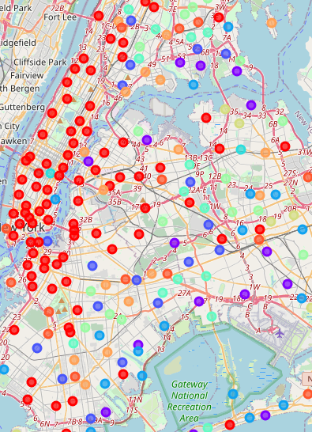
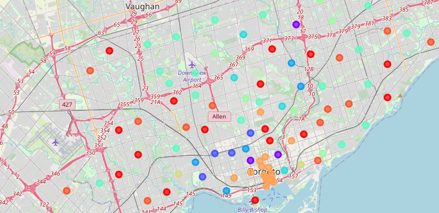

## Do Food outlets cluster?

This study investigates if types of food outlets clusters together in cities. 
The study aims to allow planners for a new restaurant to decide if they should place their venue near a similar venue or in a separate location.

This study uses Toronto and New York as two cities.  

### Introduction

Planners for a new restaurant in a major city have several options for the location of their new restaurant. 
Should they place their restaurant near to other restaurants of a similar genre or should they place the restaurant in a location separate from restaurants of a similar genre? 

### Methodology

This study uses Toronto and New York as two cities.  Lists of boroughs and Neighbourhoods and their coordinates were obtained from Wikipedia for Toronto
and from XXX for New York. 
Lists of food outlets for each location were obtained from FourSquare. 
Food outlets were clustered into 10 clusters using Kmean clustering based on the number of each of category of each food
outlet. 

### Results

Clusters are overlayed upon maps of New York and Toronto, with each colour representing a different cluster.
The colours of the clusters are not consistent between the two maps. 

Figure 1 shows the map of New York and Figure 2 shows the map of Toronto

Figure 1

 
Figure 2

 
### Discussion

Visual analysis of the clusters in both cities show a similar pattern. 
Manhattan and downtown Toronto show a small cluster of similar food outlets (orange cluster in Toronto and red cluster in New York), 
with food outlets in other areas showing no obvious pattern. 
If your food outlet fits into the cluster which suits a downtown or central location then this clustering suggests that you
should follow that clustering and locate your food outlet in a downtown or central location.    
For any other type of food outlet it would be advisable to find a less central location, with other clusters located throughout the city.

### Conclusion

Food outlets cluster together, with a distinct cluster locating in central locations in a city center. 
Other clusters follow a more distributed pattern with different clusters appearing in adjacent boroughs. 

