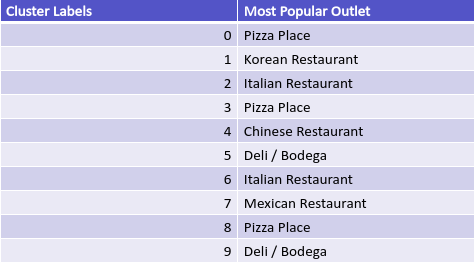

## Do Food outlets cluster?

This study investigates if types of food outlets clusters together in cities. 
The study aims to allow planners for a new restaurant to decide if they should place their venue near a similar venue or in a separate location.

This study uses Toronto and New York as two cities.  

### Introduction

Planners for a new restaurant in a major city have several options for the location of their new restaurant. 
Should they place their restaurant near to other restaurants of a similar genre or should they place the restaurant in a location separate from restaurants of a similar genre? 

### Methodology

This study uses Toronto and New York as two cities.  Lists of boroughs and Neighbourhoods and their coordinates were obtained from Wikipedia for Toronto
and from XXX for New York. 
Lists of food outlets for each location were obtained from FourSquare. 
Food outlets were clustered into 10 clusters using Kmean clustering based on the number of each of category of each food
outlet. 

### Results

Clusters are overlayed upon maps of New York and Toronto, with each colour representing a different cluster.
The colours of the clusters are not consistent between the two maps. 

Figure 1 shows the map of New York and Figure 2 shows the map of Toronto

Figure 1

 
Figure 2

 
 To ensure that the clustering wasn't just plotting the number of venues the number of food outlers per cluster were plotted and the results shown
 in figure 3 and figure 4, for New York and Toronto respectively. 
 
Figure 3

 
Figure 4

 
In New York several clusters have only a few food outlets, but overall difference can be seen in the number of outlets.
In Toronto there is more variation in the clusters with some clusters only having a few Neighbourhoods, 
suggesting a non-uniform distribution of Neighbourhoods in the clusters.  
 
The most popular food outlet per cluster is shown in the following two tables.

Table 1
New York food outlets per cluster

 
Table 2
Toronto food outlets per cluster

Several clusters have the same most popular outlet. 
 
Looking at the distribution of Pizza places and Cafes, two of the most common
popular food outlets in the above clusters, shows there isn't a large difference
in the number of these outlets in the clusters. 
 
Figure 5

 
Figure 6

Figure 7

 
Figure 8

 
This suggests even if though there is a distribution of food outlets in the clusters the most popular food outlets appear in 
most clusters in equal amounts. 
 
However, if instead of picking a popular food outlet the location of Vietnamese Restaurants
it is clear that they only exists in a few clusters in both cities(Figure 9 and 10). Here location is 
clearly important.

Figure 9

 
Figure 10

 
### Discussion

Visual analysis of the clusters in both cities show a similar pattern. 
Manhattan and downtown Toronto show a small cluster of similar food outlets (orange cluster in Toronto and red cluster in New York), 
with food outlets in other areas showing no obvious pattern.

The number of food outlets is relatively evenly distributed throughout the 
clusters and for the most popular food outlets it makes no difference where in the city 
you locate your restaurant. 
 
However, if we look at a less popular restaurant then selecting to locate in the right cluster clearly
matters

### Conclusion

Food outlets cluster together within cities. 
Popular outlets can be found in all clusters in similar amounts. 
However, less popular food outlet types are only found in selected clusters. 
So if you are looking at opening a new restaurant which is from a 
less popular genre then you may wish to locate your restaurant in a Neighbourhood which 
in which in a cluster which has similar restaurants but a low number of restaurants of your genre.
